# 各类型图表示例

## 示例1：用户注册登录流程（流程图）

**适用场景**：描述业务流程、用户操作路径

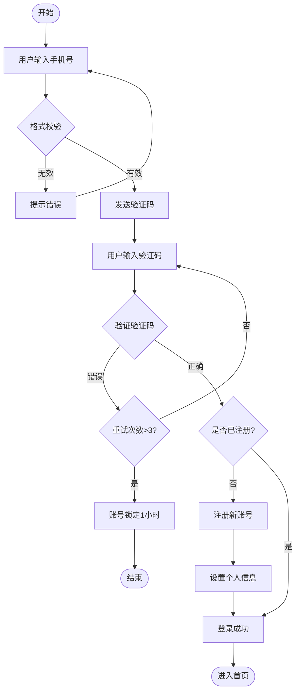

## 示例2：OAuth2.0授权码模式（序列图）

**适用场景**：API调用流程、系统间交互

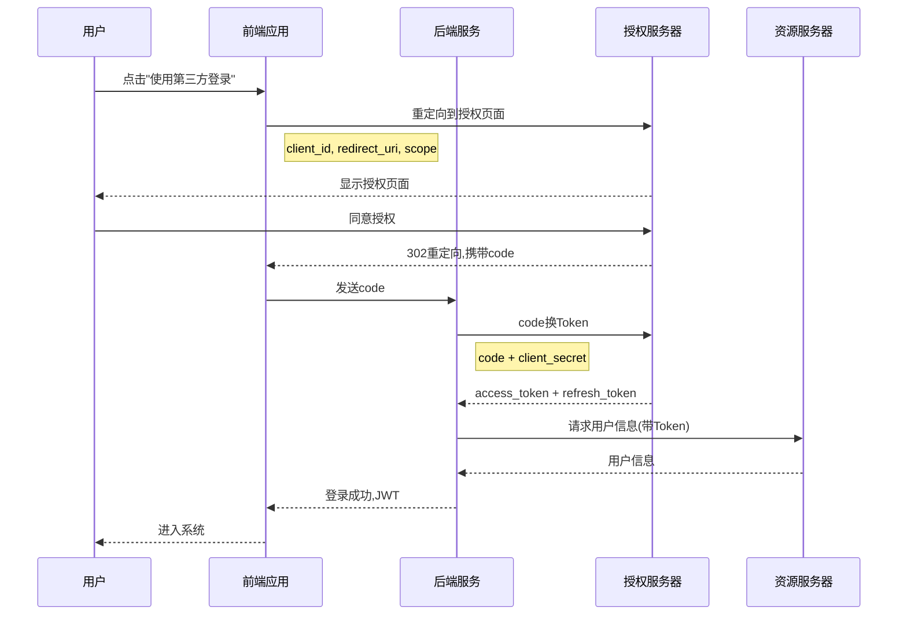

## 示例3：电商系统微服务架构（架构图/流程图）

**适用场景**：系统架构、模块关系、部署拓扑

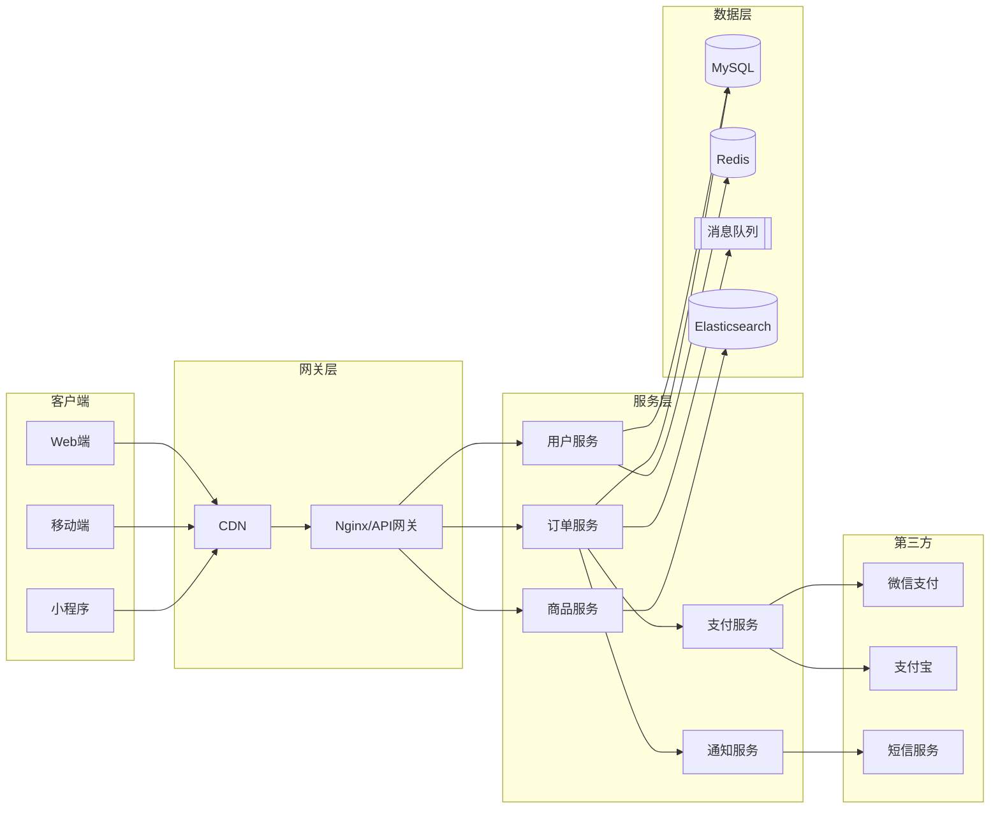

## 示例4：任务状态流转（状态图）

**适用场景**：状态机、订单状态、工单流转

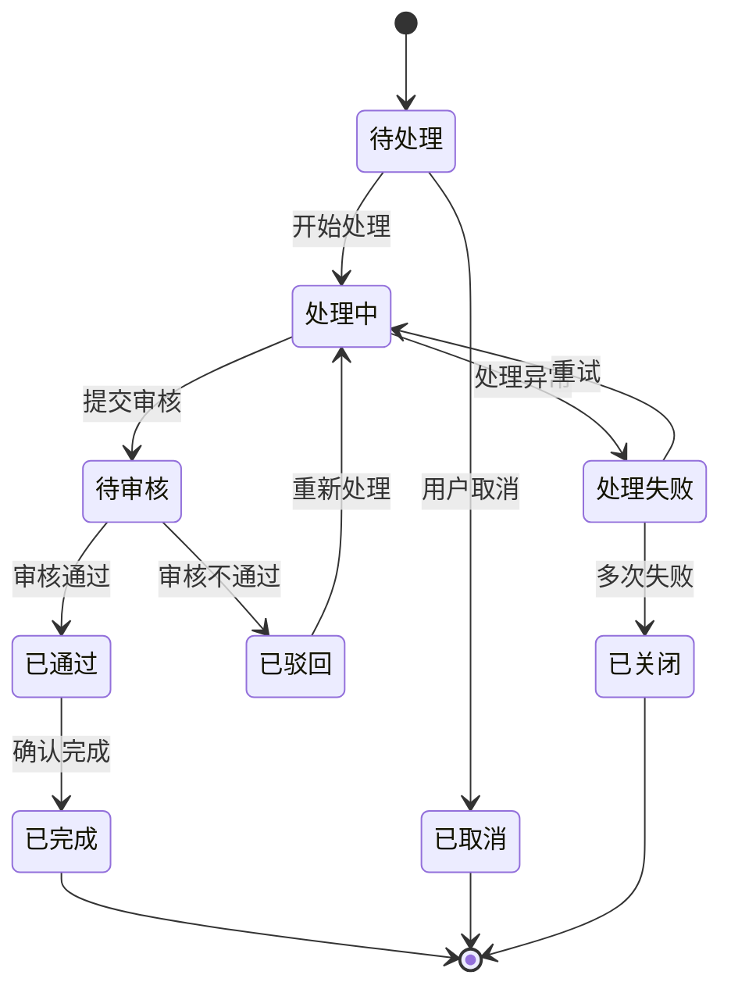

## 示例5：项目排期（甘特图）

**适用场景**：项目管理、版本计划、里程碑

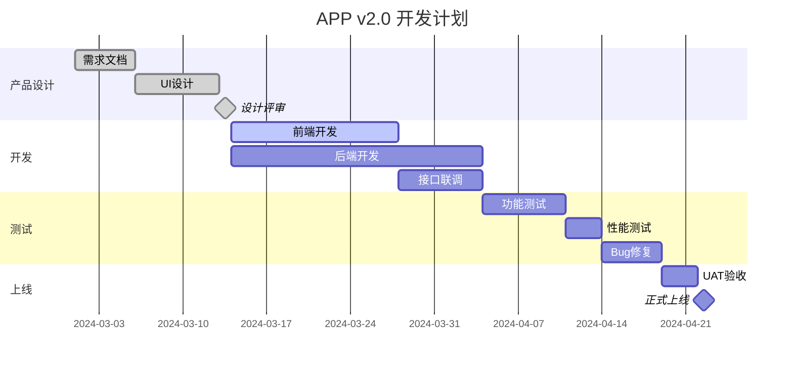

## 示例6：数据库ER图

**适用场景**：数据库设计、表关系

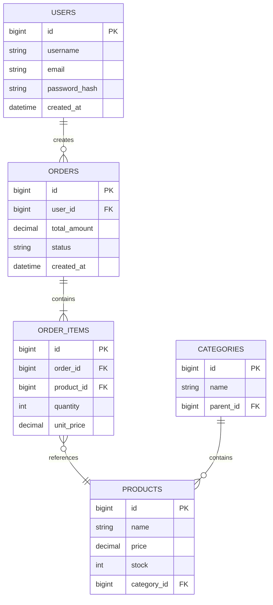

## 示例7：知识体系（思维导图）

**适用场景**：脑图、知识整理、分类

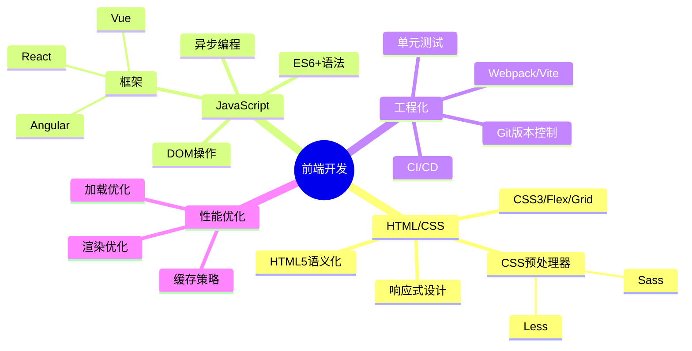

## 示例8：用户旅程地图

**适用场景**：用户体验分析、产品流程优化

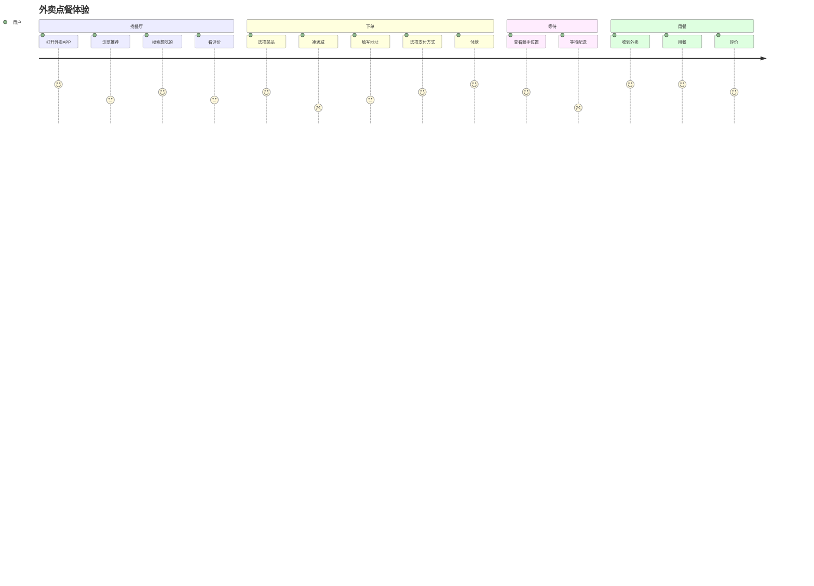

## 示例9：Git分支策略（Git Graph）

**适用场景**：Git工作流、版本管理

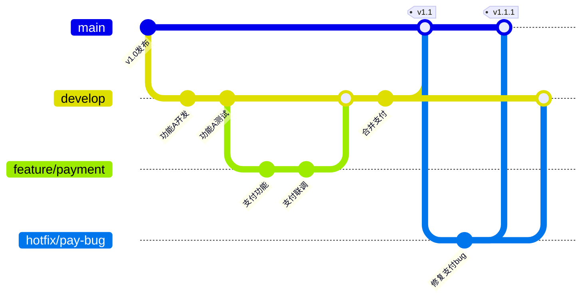

## 示例10：Graphviz DOT 复杂网络拓扑

**适用场景**：复杂依赖关系、自动布局需求

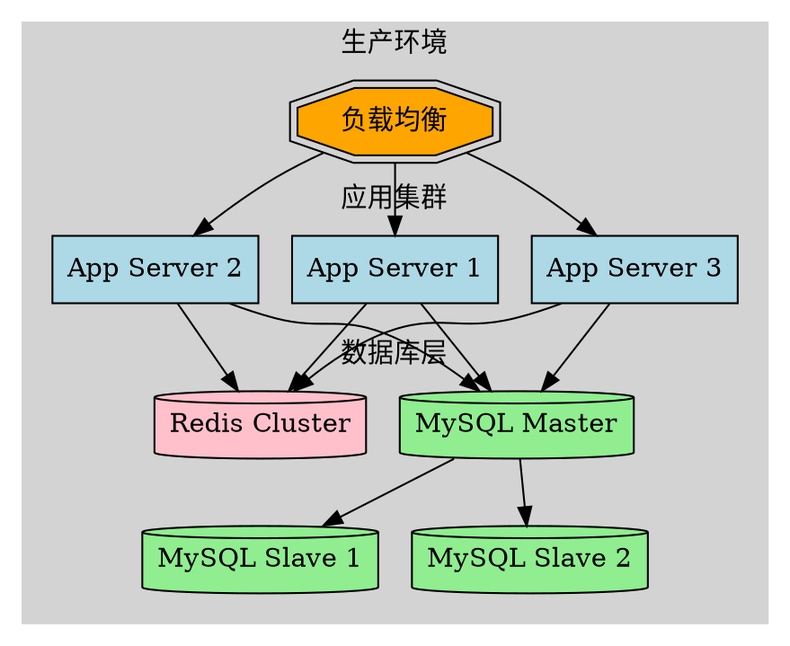

## 示例11：PlantUML 组件图

**适用场景**：UML建模、详细组件关系

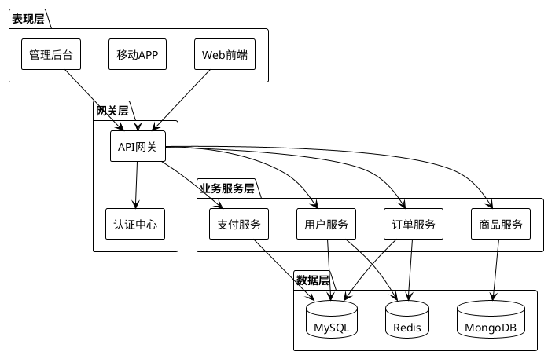

## 示例12：饼图数据可视化

**适用场景**：占比展示、分布统计

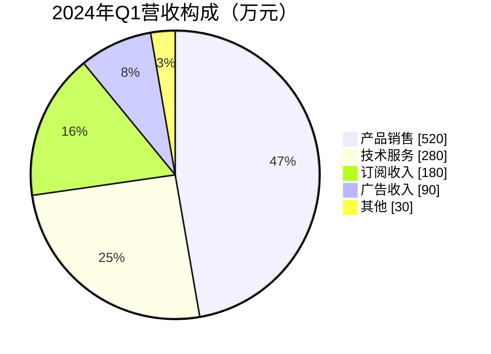
