# Mermaid 语法速查表

## 1. 流程图 (Flowchart)

### 方向声明
```
flowchart TD    # 从上到下 (Top to Down) —— 默认
flowchart TB    # 从上到下 (Top to Bottom)
flowchart BT    # 从下到上 (Bottom to Top)
flowchart LR    # 从左到右 (Left to Right)
flowchart RL    # 从右到左 (Right to Left)
```

### 节点形状
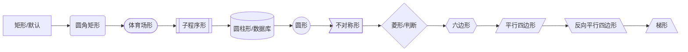

### 连线样式
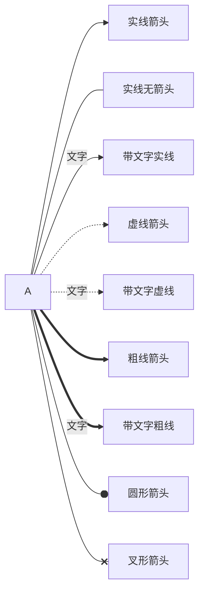

### 子图
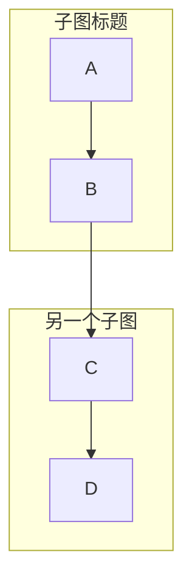

### 样式
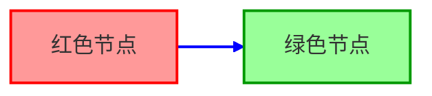

## 2. 序列图 (Sequence Diagram)

### 基本语法
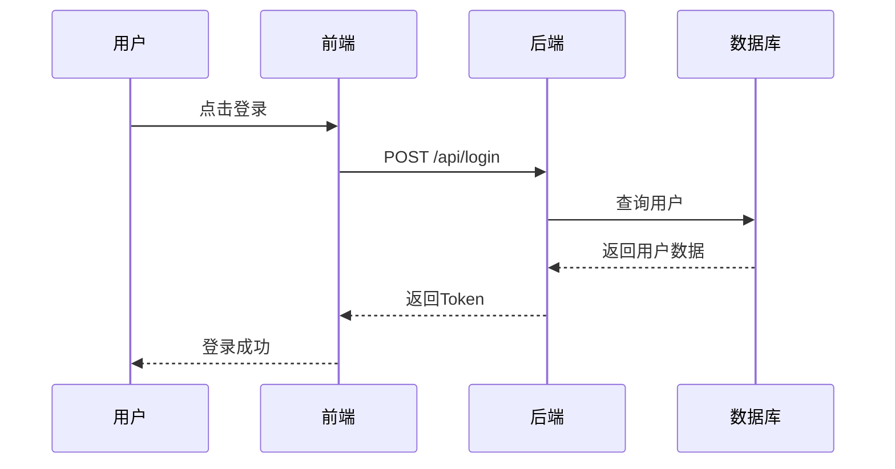

### 消息类型
```
->>     实线箭头（常用，请求）
-->>    虚线箭头（响应/返回）
-)      异步箭头（无等待）
--x     错误/终止箭头
```

### 控制结构
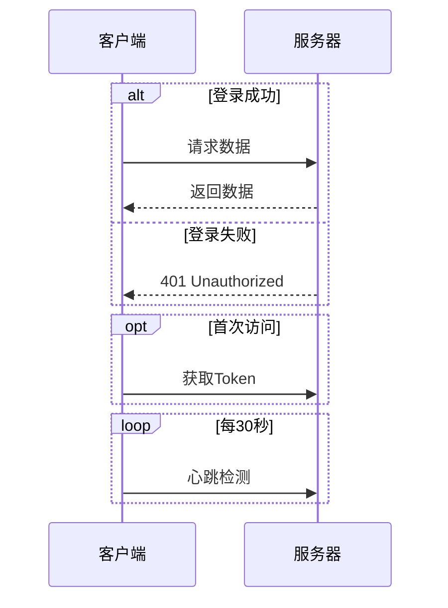

### 激活与注释
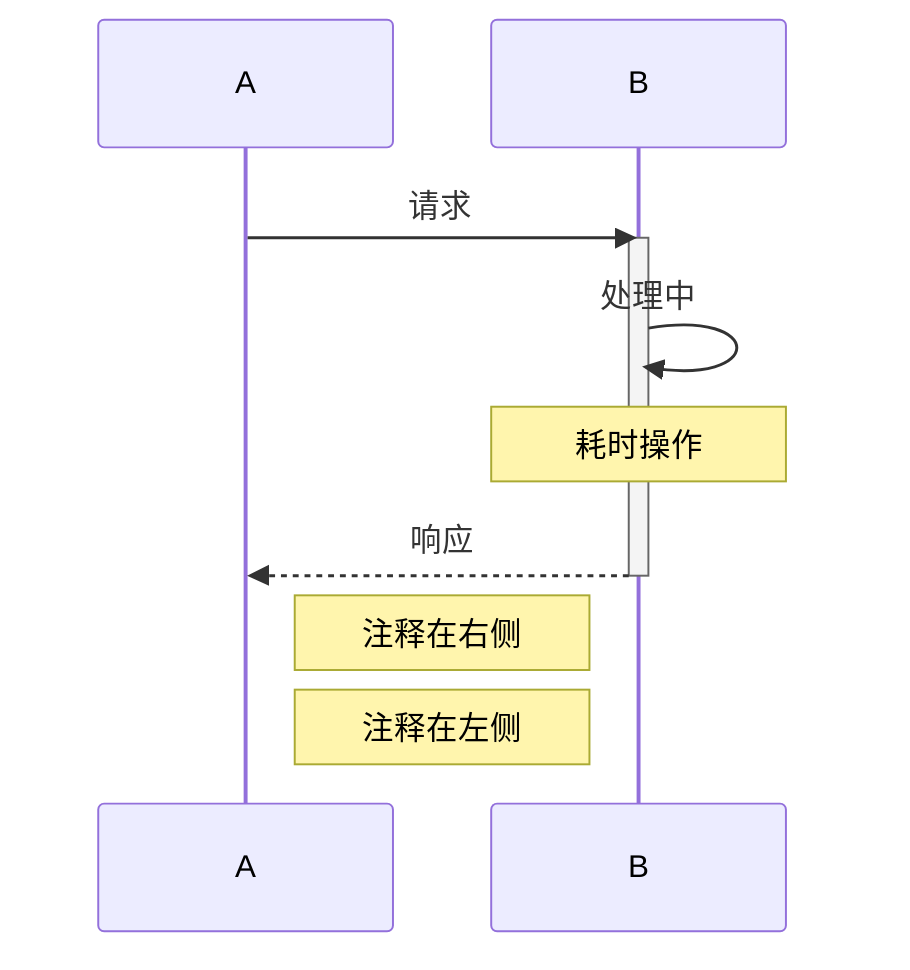

## 3. 类图 (Class Diagram)

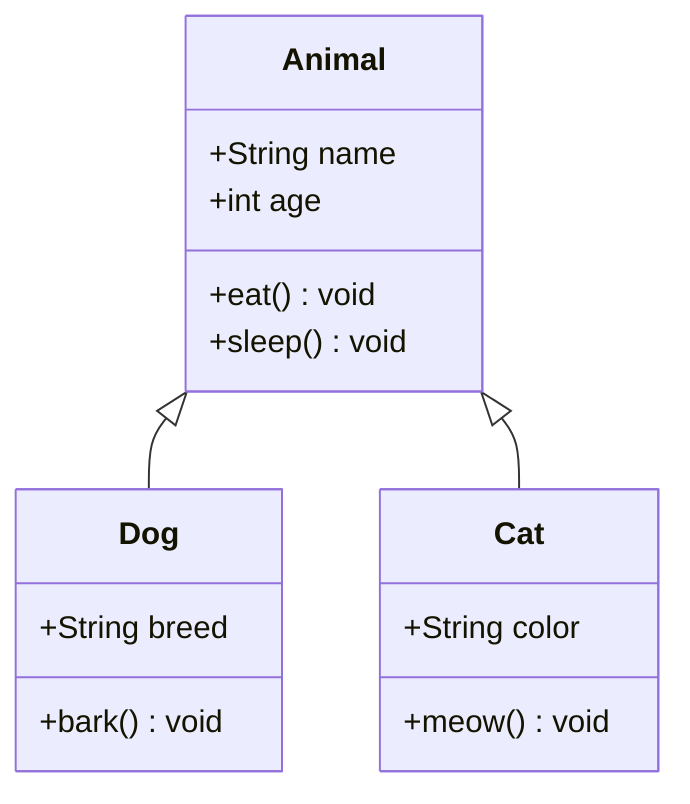

### 关系符号
| 符号 | 关系 | 含义 |
|------|------|------|
| `<\|--` | 继承 | 泛化(Generalization) |
| `*--` | 组合 | 强拥有(Composition) |
| `o--` | 聚合 | 弱拥有(Aggregation) |
| `-->` | 关联 | 引用(Association) |
| `..>` | 依赖 | 使用(Dependency) |
| `<\|..` | 实现 | 接口实现(Realization) |

### 可见性标记
```
+   Public
-   Private
#   Protected
~   Package/Internal
```

## 4. 状态图 (State Diagram)

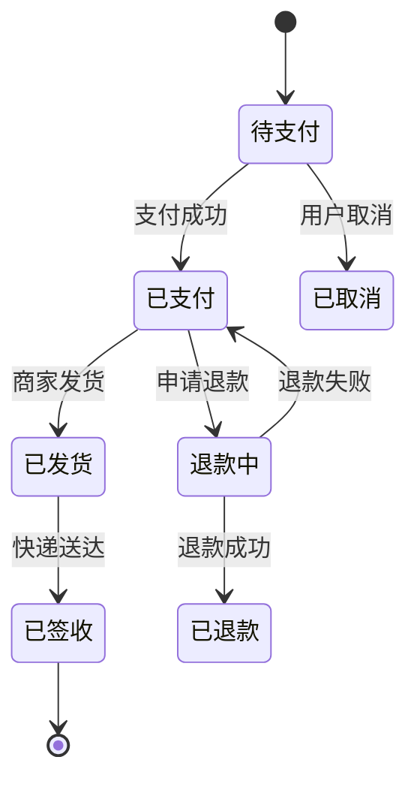

### 状态语法
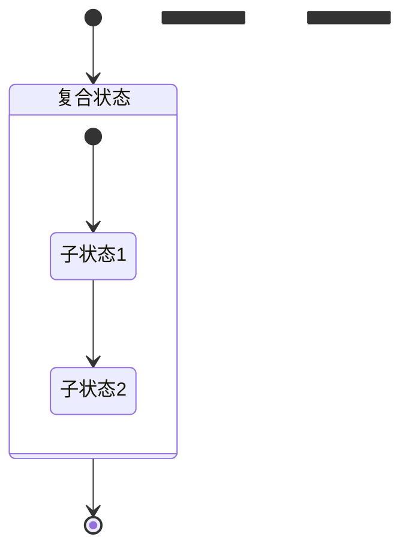

## 5. 甘特图 (Gantt)

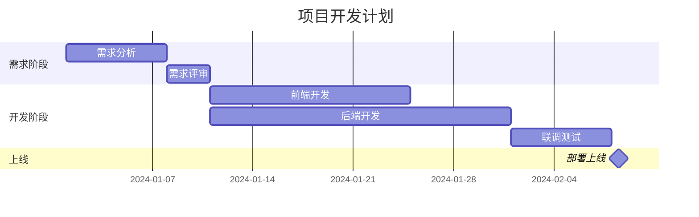

### 甘特图语法
```
title 标题
dateFormat YYYY-MM-DD    # 日期格式
section 分组名
任务名    :[id,] [start,] duration|end
任务名    :crit, [id,] ...    # 关键任务（红色高亮）
任务名    :done, [id,] ...    # 已完成
任务名    :active, [id,] ...  # 进行中
任务名    :milestone, [id,] ...  # 里程碑
```

## 6. 饼图 (Pie Chart)

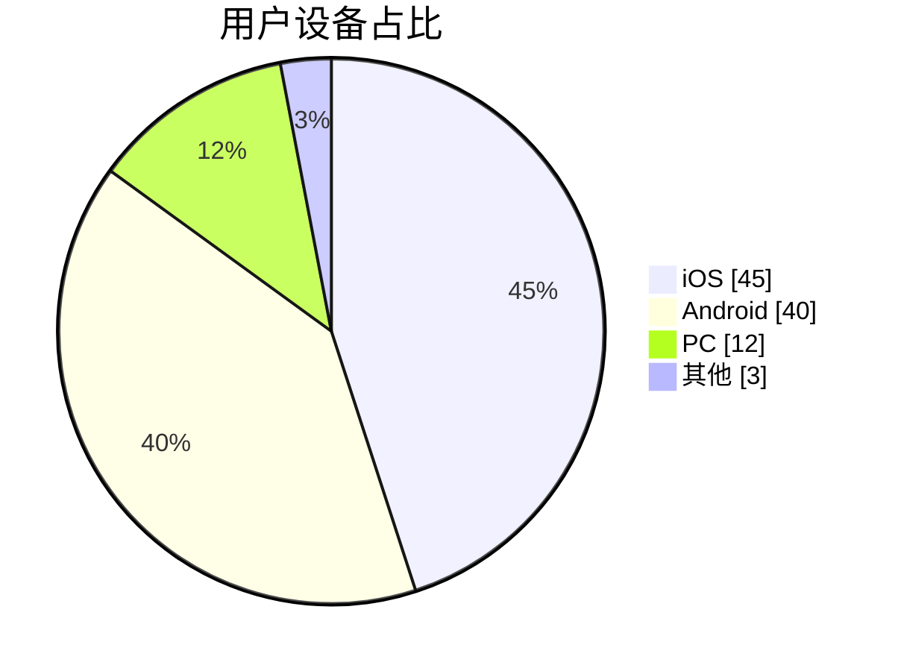

## 7. ER图 (Entity Relationship)

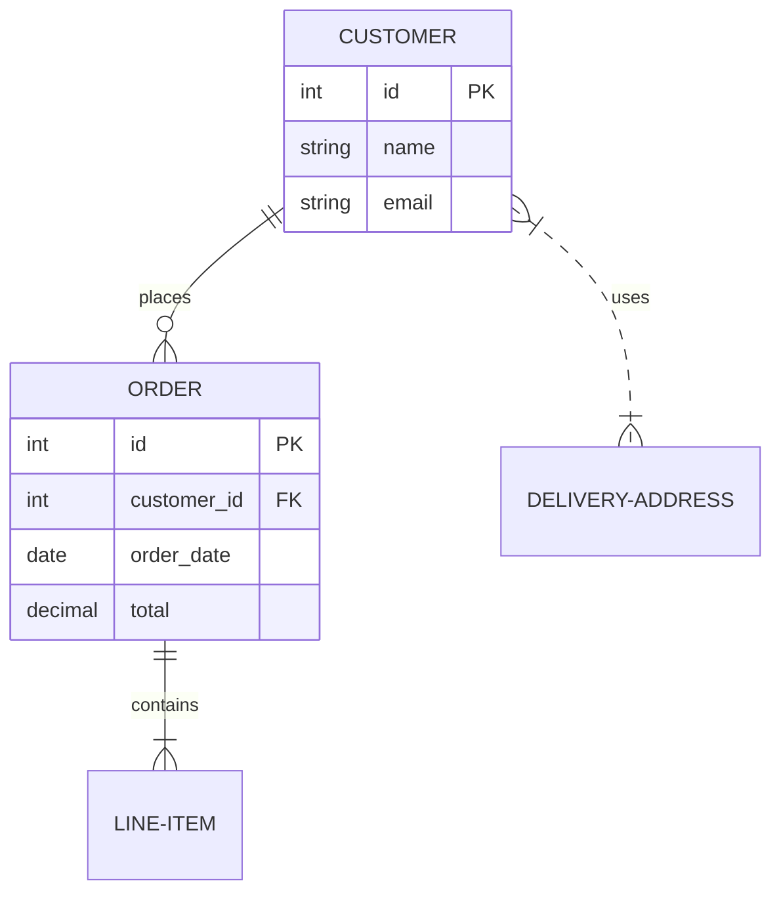

### 关系符号
| 符号 | 含义 |
|------|------|
| `\|o` | 零或一个 |
| `\|\|` | 恰好一个 |
| `}o` | 零或多个 |
| `}\|` | 一个或多个 |

## 8. Git图 (Git Graph)

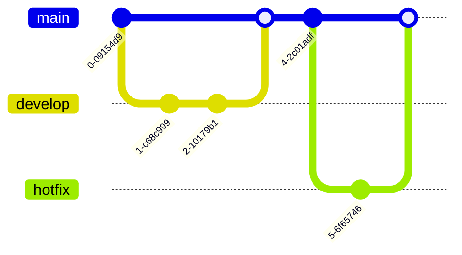

## 9. 思维导图 (Mindmap)

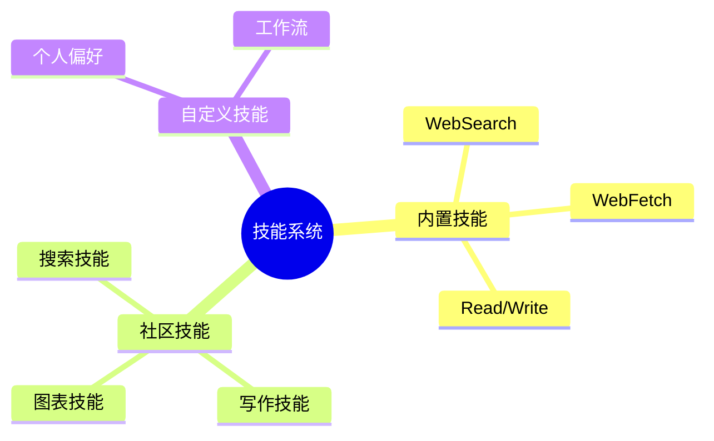

## 10. 用户旅程图 (User Journey)

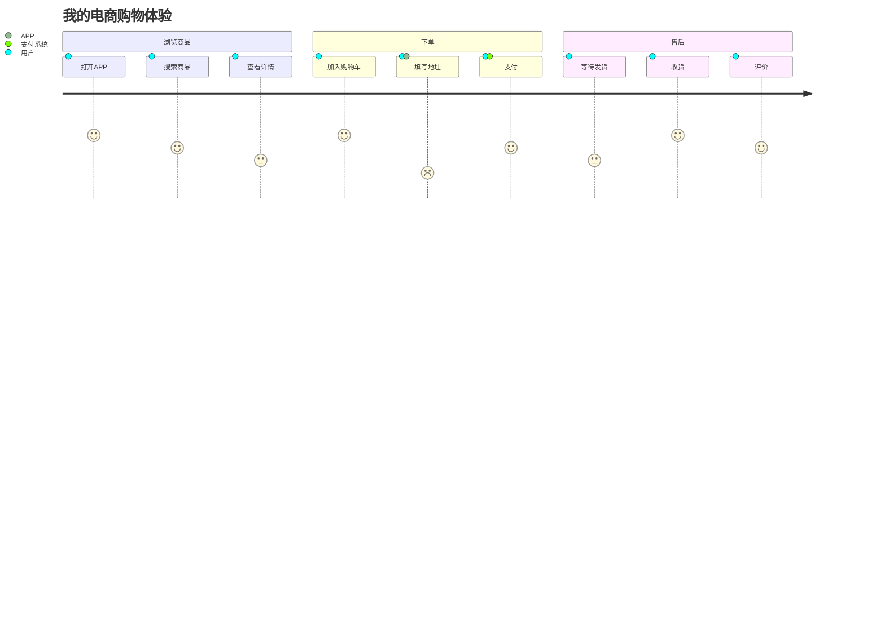

## 11. 常用样式技巧

### 节点内换行
```
A[第一行<br/>第二行]
```

### Markdown文字（加粗/斜体）
```
A["**加粗** 和 *斜体*"]
```

### 中文节点注意事项
- 中文节点名建议加双引号：`A["用户登录模块"]`
- 避免在节点名中使用特殊字符：`( ) [ ] { } "`

### 方向选择建议
- 流程图、时间线 → TD（从上到下）
- 架构图、层级结构 → LR（从左到右）
- 状态机 → TD
- 序列图 → 不需要指定方向
